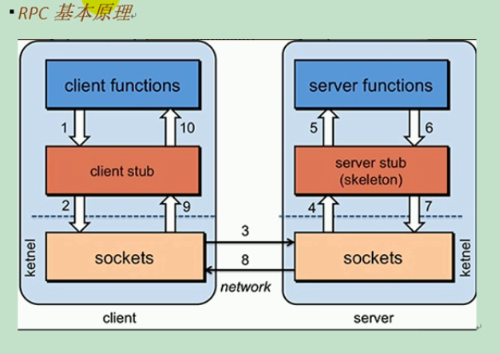
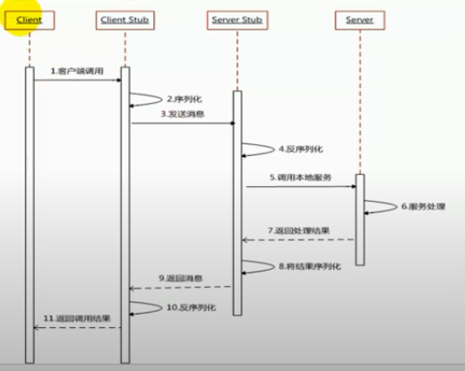
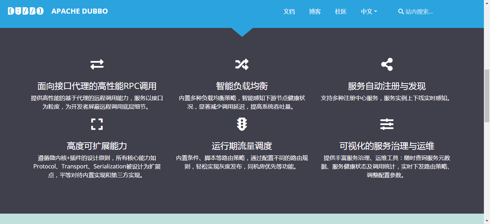
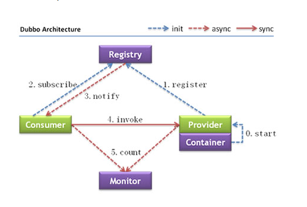

Dubbo

## 分布式系统

​		若干个不同的计算机、不同的服务组成一套服务系统，就像一个单体的服务系统一样。满足高并发、高可用的需求。

​		不同服务之间的调用采用rpc（远程过程调用）进行调用

## rpc原理



​			建起网络连接，然后进行通讯。效率取决于网络通信和序列化效率（json、xml、二进制流）



## dubbo架构





Zookeeper注册中心

1、下载Zookeeper

2、修改配置文件zoo_sample.cfg为zoo.cfg，并更改默认数据存储目录

~~~
dataDir=../data
~~~

3、启动Zookeeper 在bin目录下找命令

## 配置优先顺序

1、精确优先

2、消费者优先、提供者次之

两者同时执行，也就是说在同一个接口级别或者方法级别，消费者的级别优先于提供者

但是方法级别的优先大于接口级别

精确优先级别要大于消费者优先

~~~
timeout 和 retries
二者配合使用，timeout固定了服务超时时间，retires是重试的次数（不包含第一次的访问）
retries使用的条件是幂等（查询）【每次执行的结果都是一致的】
check
就是启动服务时，检查所引用的服务在注册中心是否存在，如果不存在则启动失败，默认为true
~~~

## 多版本

~~~xml
<!-- version 提供方-->
<dubbo:service interface="com.beitie.base.service.UserService" ref="userService_provider"
	timeout="10000" retries="0" version="1.0.0"> 
</dubbo:service>
<dubbo:service interface="com.beitie.base.service.UserService" ref="userService_provider2" timeout="10000" retries="0" version="2.0.0"> 
</dubbo:service>
~~~

~~~xml
<!-- version 消费方-->
<dubbo:reference id="consumerService" interface="com.beitie.base.service.UserService" timeout="100000"
retries="0" version="1.0.0">
<!-- version 消费方
version 指定了要调用的版本
当指定* 时，从所有的版本的随机调用
-->
~~~

## 本地存根

相当于spring的aop功能，在调用代理接口时，进行校验，出错返回信息，以及最终处理信息的实现。

使用方法：

1、创建一个类实现服务接口

2、勒种要实现接口的所有方法

3、类中提供一个有参构造器，注入代理对象

~~~java
public UserServiceStub(UserService userService) {
        super();
        this.userService = userService;
}
~~~

4、在实现方法中添加preProcess、postProcess、以及afterThrowing（try 。。。catch中catch方法体内语catchProcess句），以及最终处理语句finalProcess

5、在dubbo.xml中或者注解中加入执行存根的配置

~~~xml
 <dubbo:reference id="consumerService" interface="com.beitie.base.service.UserService" timeout="100000"
 retries="0" version="1.0.0" stub="com.beitie.stub.UserServiceStub">
~~~

或者

~~~java
@Reference(version = "1.0.0" ,check = false,stub = "com.beitie.stub.UserServiceStub")
UserService userService;
~~~

至此，配置搞定

注意：

​		默认情况下，实现类和实现的服务接口为同包，并且为实现服务接口后面添加xxxxStub，这样的存根这需要配置为

~~~xml
 <dubbo:reference id="consumerService" interface="com.beitie.base.service.UserService" timeout="100000"
 retries="0" version="1.0.0" stub="true">
~~~

或者

~~~java
@Reference(version = "1.0.0" ,check = false,stub = "true")
UserService userService;
~~~

## 与springboot整合

1、引入依赖

~~~xml
<!--dubbo的依赖包 -->
<dependency>
     <groupId>org.apache.dubbo</groupId>
     <artifactId>dubbo-spring-boot-starter</artifactId>
     <version>2.7.3</version>
</dependency>
<!--springweb的依赖包 -->
<dependency>
    <groupId>org.springframework.boot</groupId>
    <artifactId>spring-boot-starter-web</artifactId>
    <version>2.2.6.RELEASE</version>
</dependency>
~~~

2、配置application.xml

~~~properties
dubbo:
  application:
    name: service_consumer
  registry:
    address: zookeeper://127.0.0.1:2181
  monitor:
    protocol: registry
  consumer:
    check: true
server:
  port: 9002
~~~

~~~properties
dubbo:
  application:
    name: provider_service
  registry:
    address: 127.0.0.1:2181
    protocol: zookeeper
  protocol:
    name: dubbo
    port: 20881
  monitor:
    protocol: registry
server:
  port: 9001

~~~

3、在dubbo.xml中或者在类中通过注解进行配置，或者在config配置类中配置（配置类中配置等价于dubbo.xml的配置）

~~~java
@Service 来暴露服务的接口 
eg：
@Service(version = "1.0.0")
@Component
public class UserServiceImpl implements UserService {
 ......   
}
    
    
    
@referrence 类引用服务接口 
eg：
@Reference(version = "1.0.0" ,check = false,stub = "com.beitie.stub.UserServiceStub")
    UserService userService;
~~~

xml中的配置省略

## Zookeeper宕机	

监控中心宕掉不影响使用，只是丢失部分采样数据
数据库宕掉后，注册中心仍能通过缓存提供服务列表查询，但不能注册新服务
注册中心对等集群，任意一台宕掉后，将自动切换到另一台
注册中心全部宕掉后，服务提供者和服务消费者仍能通过本地缓存通讯
服务提供者无状态，任意一台宕掉后，不影响使用
服务提供者全部宕掉后，服务消费者应用将无法使用，并无限次重连等待服务提供者恢复

此外，如果没有缓存可以通过dubbo直连的方式

## 负载均衡策略

### Random

### RoundRobin

### LeastActive	

### ConsistentHash

**消费端**

```xml
<!-- 服务级别 -->
<dubbo:reference interface="..." loadbalance="roundrobin" />
<!-- 方法级别	 -->
<dubbo:reference interface="...">
    <dubbo:method name="..." loadbalance="roundrobin"/>
</dubbo:reference>
```

服务端

```xml
<!-- 服务级别 	 -->
<dubbo:service interface="..." loadbalance="roundrobin" />
<!-- 方法级别	 -->
<dubbo:service interface="...">
    <dubbo:method name="..." loadbalance="roundrobin"/>
</dubbo:service>
```

## 服务降级

​		服务器压力过大时，对部分服务采取不处理或者简单处理，从而减轻服务器压力的过程，以达到服务器高效运作的目的。可以通过服务降级来屏蔽非关键的出错业务，并定义降级后的返回策略。

​	其中：

- `mock=force:return+null` 表示消费方对该服务的方法调用都直接返回 null 值，不发起远程调用。用来屏蔽不重要服务不可用时对调用方的影响。相当于屏蔽功能，不允许远程调用
- 还可以改为 `mock=fail:return+null` 表示消费方对该服务的方法调用在失败后，再返回 null 值，不抛异常。用来容忍不重要服务不稳定时对调用方的影响。

## 服务容错

断路器的使用hystrix

参考springcloud的使用

## dubbo原理

使用的rpc框架，运用netty的nio（not blocking io）非阻塞io

框架设计


netstat -aon|findstr "9050"


tasklist|findstr "2016"


taskkill /f /t /im tor.exe