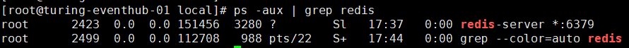

## 常见问题

### 不能ping通外网ip

1. vim /etc/sysconfig/network-scripts/ifcfg-ens33

   1）将 BOOTPROTO=“DHCP” 改为：BOOTPROTO=“**static**”；

   2）将 ONBOOT=“on” 改为：ONBOOT=“**yes**”；

   3）添加静态ip配置

~~~
BROADCAST=192.168.220.255 #广播地址（最后一个） 192.168.220.0#网络号（第一个）
IPADDR=192.168.220.132 #设置的静态ip
NETMASK=255.255.255.0	#子网掩码 
GATEWAY=192.168.220.2  #网关 很重要，是连接外部网络的中转站
DNS1=114.114.114.114 #域名解析服务器 其配置后网络启动后在/etc/resolv.conf的nameserve一致
~~~

a、外部网络的判断是根据子网掩码来进行判断，是否位于同一个网段，是否属于外部网络

b、ip一共占有32位，一共分为四段，每段分8位，子网掩码中所有位为1的位为广播段，为0的为网络号（开始位置）

c、网关的选择，必须要有路由功能主机

### 无法停止进程

ctrl + c 无法停止，可以试试ctrl  + z

ctrl + z 之后需要杀死进程

### 杀死进程

kill -9 pid

### 查找进程

ps -ef |grep tomcat

ps：显示进程的信息

grep ：文本查找，并把匹配的显示出来

-e：显示所有的进程

-f：全格式显示

服务启动

service network restart | start |stop

service keepalived start |stop |restart

## Vim使用

1、需要授权的文件需要root进行登录

2、输入i 开始修改文件

3、esc退出编辑状态

4、:wq退出并保存文件 :x和此功能类似

5、：q没有修改的正常退出，：q！强制退出并销毁更改的内容

## 常用命令

~~~java
rm -rf  目录或文件 #递归删除
cp -rf  目录或文件 #递归复制
mv -rf  目录或文件 #递归移动
~~~

## 环境变量

~~~
/usr/local/bin  #移至此目录下的命令可以直接执行
~~~

tail -f 循环读取文件的内容（默认末尾10行内容）

## 切换用户

su （switch user） username：eg：su root 

## 查看用户

~~~
cat /etc/passwd
~~~

查找安装目录

ps -ef | grep 【redis】

然后根据进程号查找安装目录

ll /proc/2423[进程号]/cwd

