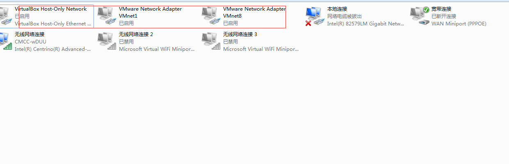

## 常见问题

### 不能ping通外网ip

1. vim /etc/sysconfig/network-scripts/ifcfg-ens33

   1）将 BOOTPROTO=“DHCP” 改为：BOOTPROTO=“**static**”；

   2）将 ONBOOT=“on” 改为：ONBOOT=“**yes**”；

   3）添加静态ip配置

~~~
BROADCAST=192.168.220.255 #广播地址（最后一个） 192.168.220.0#网络号（第一个）
IPADDR=192.168.220.132 #设置的静态ip
NETMASK=255.255.255.0	#子网掩码 
GATEWAY=192.168.220.2  #网关 很重要，是连接外部网络的中转站
DNS1=114.114.114.114 #域名解析服务器 其配置后网络启动后在/etc/resolv.conf的nameserve一致
~~~

a、外部网络的判断是根据子网掩码来进行判断，是否位于同一个网段，是否属于外部网络

b、ip一共占有32位，一共分为四段，每段分8位，子网掩码中所有位为1的位为广播段，为0的为网络号（开始位置）

c、网关的选择，必须要有路由功能主机

### 无法停止进程

ctrl + c 无法停止，可以试试ctrl  + z

ctrl + z 之后需要杀死进程

### 杀死进程

kill -9 pid

### 查找进程

ps -ef |grep tomcat

ps：显示进程的信息

grep ：文本查找，并把匹配的显示出来

-e：显示所有的进程

-f：全格式显示

服务启动

service network restart | start |stop

service keepalived start |stop |restart

## Vim使用

1、需要授权的文件需要root进行登录

2、输入i 开始修改文件

3、esc退出编辑状态

4、:wq退出并保存文件 :x和此功能类似

5、：q没有修改的正常退出，：q！强制退出并销毁更改的内容

~~~
pageup|pagedown 上下翻页
home | end 返回行首和行尾
G 移动文档最后一行 gg移动文档首行
yy 复制光标所在的那一行 y代表复制 复制内容到缓冲区，并没有粘贴板【需配合p和P粘贴功能放到粘贴板】
dd 删除光标所在的那一行 剪切这一行 d代表剪切，剪切内容到缓冲区，并没有到粘贴板【需配合p和P粘贴功能放到粘贴板】
p【P】 p放在所在光标的后面 P放在所在光标的前面 如果是复制整行的话，放在当前光标前或者后的那一行
u 复原上一个动作
~~~

## 常用命令

~~~java
rm -rf  目录或文件 #递归删除 -r 递归删除 -f强制删除 -i删除前先进行询问
cp -rf  目录或文件 #递归复制
mv -rf  目录或文件 #递归移动 如果放在同一个位置相当于重命名
mkdir -p 创建目录 # -p如果指定目录的父目录不存在，则进行创建
cat file1 file2 > file3 #将file1和file2文件的内容合并后清空file3的内容，写入file3
cat file1 file2 >> file3#将file1、file2和file3文件的内容合并后写入file3【追加方式追加入file3后面】

~~~

## 环境变量

~~~
/usr/local/bin  #移至此目录下的命令可以直接执行
~~~

tail -f 循环读取文件的内容（默认末尾10行内容）

## 切换用户

su （switch user） username：eg：su root 

## 查看用户

~~~
cat /etc/passwd
~~~

## 查找文件

~~~
find -name 【filename】
-name 按照名字查找
-type 按照类型查找
-size 按照文件大小查找
~~~

## 查找安装目录

~~~
ps -ef | grep 【redis】 -i # -i查找时忽略大小写 -n显示行号
~~~

然后根据进程号查找安装目录

ll /proc/2423[进程号]/cwd

winscp连接注意问题

1、需要开启虚拟主机的网络

2、需要启动服务

查看状态命令：systemctl status sshd.service

启动服务命令：systemctl start sshd.service

停止服务命令：systemctl stop sshd.service

重启服务命令：systemctl restart sshd.service

开机自启命令：systemctl enable sshd.service

删除自启命令：systemctl disable sshd.service

## 权限设置

-R 递归修改权限

u:所有者权限 g:所属组权限 o:其他用户权限 a:全部用户

r: 读权限，数字表示为4 w:写权限，数字表示为2 x:执行权限，数字表示为1

chmod 777 file 等同于 chmod a=rwx file 所有用户有可读可写可执行权限

 

## 命令行快捷键

ctrl + u  删除光标前所有内容

ctrl + k	删除光标后所有内容

ctrl + a	移动到行首

ctrl + e 	移动到行尾

ctrl + insert 复制

shift + insert 粘贴

## 根目录【/】和 【~】

根目录【/】是最顶层目录

【~】是用户所在目录：root用户目录对应的/root，普通用户对应的/home/beitie[用户名]

## 压缩/解压文件

常用参数：

-c 建立压缩文件

-x 解压

-t 查看内容

-v 显示所有过程

-z 用gzip压缩解压

-j 用bzip2压缩解压

-f 使用文件名（必须有的参数且是最后一个参数）

解压：

*.tar       tar -xvf

*.tar.gz      tar -xzf

*tar.bz2    tar -xjf

