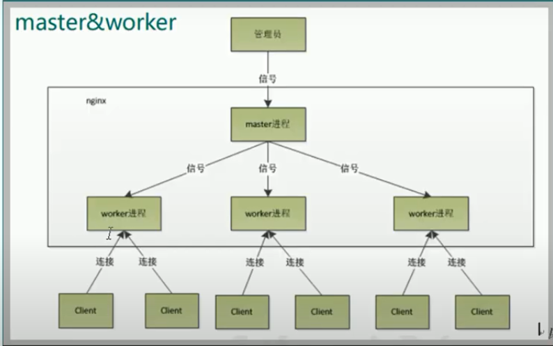
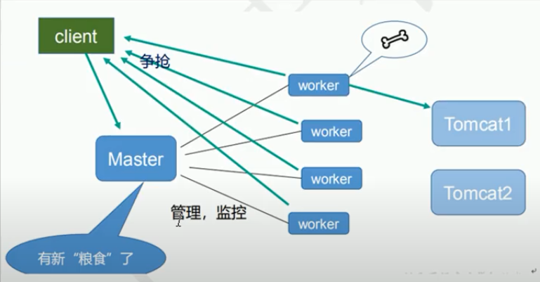

## 简介

nginx是一个高性能的http和反向代理的web服务器。占用内存少，并发性能好，支持50000个并发的连接数

用途：

1、正向代理和反向代理

​		**正向代理**（forward proxy）：是一个位于客户端和目标服务器之间的服务器(代理服务器)，为了从目标服务器取得内容，客户端向代理服务器发送一个请求并指定目标，然后代理服务器向目标服务器转交请求并将获得的内容返回给客户端。

​		用途：这种代理其实在生活中是比较常见的，比如访问外国网站技术，其用到的就是代理技术。


​		**反向代理**（reverse proxy）：是指以代理服务器来接受internet上的连接请求，然后将请求转发给内部网络上的服务器，并将从服务器上得到的结果返回给internet上请求连接的客户端，此时代理服务器对外就表现为一个反向代理服务器。

​		用途：隐藏服务器的真正ip、负载均衡

区别：

1、**正向代理其实是客户端的代理**，帮助客户端访问其无法访问的服务器资源。**反向代理则是服务器的代理**，帮助服务器做负载均衡，安全防护等。


2、**正向代理一般是客户端架设的**，比如在自己的机器上安装一个代理软件。而**反向代理一般是服务器架设的**，比如在自己的机器集群中部署一个反向代理服务器。


3、**正向代理中，服务器不知道真正的客户端到底是谁**，以为访问自己的就是真实的客户端。而在**反向代理中，客户端不知道真正的服务器是谁**，以为自己访问的就是真实的服务器


4、正向代理和反向代理的作用和目的不同。**正向代理主要是用来解决访问限制问题。而反向代理则是提供负载均衡、安全防护等作用。二者均能提高访问速度。**

2、静态文件处理

3、负载均衡

4、动静分离

5、高可用

## 反向代理

正向代理：客户端需要配置代理服务器

反向代理：客户端无须配置代理服务器，不会暴露真正的服务器

## 负载均衡

将负载平均分配在不同的服务单元上面，减轻服务器的压力

~~~
server {
        listen       9001;	#要监听的接口
        server_name  192.168.220.131; #要监听的主机

        location ~ /edu/ {
		proxy_pass http://192.168.220.131:8080; #将被重定向的服务器
            root   html;
            index  index.html index.htm;
        }
        location ~ /vod/ {
            proxy_pass http://192.168.220.131:8081;#将被重定向的服务器
        }
}
~~~

URL：统一资源定位符 http://192.168.220.131:8080

URI：统一资源标识符 URL是URI的子集，只要可以唯一标识网络资源就是URI

在nginx里这样解释

~~~
server {
    listen       9001;	#要监听的接口
    server_name  www.myserver; #要监听的主机[域名或者ip地址]
    location ~ /edu/ {
            proxy_pass http://192.168.220.131:8080; #将被重定向的服务器 1
            proxy_pass http://192.168.220.131:8081/myinfo/; #将被重定向的服务器 2
                root   html;
                index  index.html index.htm;
     }    
}
~~~

“/edu/”可以解释为URI，同样proxy_pass http://192.168.220.131:8081/myinfo/中“/myinfo/”也可以理解为URI。“/myinfo/”的两个斜杠一个都不能少，后面的少了之后在拼接后续uri时候会出现没有斜杠的问题

当url总包含uri时，请求的url将会被替代

如http://www.myserver/edu/a/1  将会匹配到2，然后被重定向到http://192.168.220.131:8081/myinfo/a/1，如果没有2，将不会更改请求的地址http://192.168.220.131:8080/edu/a/1

### 分配策略

~~~
http{
	resolve 114.114.114.114 #为server指定域名解析器
	upstream myserver {
        server 192.168.220.131:8080 max_fails=3 fail_timeout=15;
        server 192.168.220.131:8081 backup;#所有服务器不能使用时才使用的
        server 192.168.220.131:8082 max_conns=100;
        server 192.168.220.131:8083 weight=10 #权重规则默认值为1
        server www.example.com
        fair;#执行公平原则，响应时间原则
        ip_hash;#执行同一个用户访问在同一个服务器上面，实现sesion的不丢失
        
    }
    server {
        listen       80;
        server_name  192.168.220.131;

        #charset koi8-r;

        #access_log  logs/host.access.log  main;

        location / {
            root   html;
           proxy_pass http://myserver;
            index  index.html index.htm;
        }
	}
}
 

~~~

max_fails：最大失败次数，默认值为1.超过最大次数时，在fail_timeout之内不会再次向该服务器发送请求。	

fail_timeout：失败超时时间，和max_fail配合使用，默认值为10s

backup：备份服务器，所有服务器挂了才会执行的服务器

max_conns：最大连接数，超过这个连接数，不会再向该服务器发送请求

resolve：为server指定的域名提供域名解析器

ip_hash：根据ip进行计算分配到不同的服务器，局限性非常大，新增或者减少服务器或者服务器宕机均会影响，而且如果有前置的负载均衡策略和后置的负载均衡侧率都会产生影响

url_hash：（包含请求的参数）一致性hash，可以设置为访问资源时的策略，比如下载大型文件，分别缓存在不同的服务器上面，此时设置通过url_hash时就可以同一个资源请求访问到同一台服务器上面，然后就访问了同样的资源，不用过多的缓存资源

hash $uri : uri不包含请求的参数 

**轮询**

默认配置，依次轮流访问服务器

**权重weight**

weight默认值为1，权重越高，分在的负荷越多

**ip_hash**

每个用户访问服务器，会被分配到同一台服务器上面，用于session共享问题

**fair方式**

根据请求的响应时间来分配

## 动静分离

### 实现方法

1、通过将静态文件部署在单独的服务器上设置成单独的域名，目前最流行推崇的方式

~~~

server {
	listen 80;
	server_name 192.168.220.131;
	
	location /html/ {
        root /static/; #在root下面新建的static目录
        autoindex on;
        charset utf-8;
	}
	location /image/ {
        root /static/;
        autoindex on;
        charset utf-8;
        expire 3d;
	}
}
~~~


2、将静态和动态文件部署在一起，通过nginx的配置分离开来

expire 设置浏览器缓存的过期时间，当缓存尚未过期之时，拉取静态文件，会判断文件的最后更新时间是否一致，如果一致，则直接从缓存中读取，返回状态304，如果不一致，则重新从服务器下载文件，返回状态200

## nginx安装

### 一、安装编译工具及库文件

~~~c#
yum -y install make zlib zlib-devel gcc-c++ libtool  openssl openssl-devel
~~~

### 二、首先要安装 PCRE

#### 1、下载

```c#
[root@bogon src]# cd /usr/local/src/
[root@bogon src]# wget http://downloads.sourceforge.net/project/pcre/pcre/8.35/pcre-8.35.tar.gz
```

#### 2、解压安装包

~~~c#
[root@bogon src]# tar zxvf pcre-8.35.tar.gz
~~~

#### 3、进入安装包目录

```c#
[root@bogon src]# cd pcre-8.35
```

#### 4、编译安装 

```
[root@bogon pcre-8.35]# ./configure
[root@bogon pcre-8.35]# make && make install
```

#### 5、查看pcre版本

~~~c#
[root@bogon pcre-8.35]# pcre-config --version
~~~

### 三、安装nginx

#### 1、下载nginx

```c#
[root@bogon src]# cd /usr/local/src/
[root@bogon src]# wget http://nginx.org/download/nginx-1.6.2.tar.gz
```

2、解压安装包

```c#
[root@bogon src]# tar zxvf nginx-1.6.2.tar.gz
```

3、进入安装包目录

```c#
[root@bogon src]# cd nginx-1.6.2
```

4、编译安装

```c#
[root@bogon nginx-1.6.2]# ./configure --prefix=/usr/local/webserver/nginx --with-http_stub_status_module --with-http_ssl_module --with-pcre=/usr/local/src/pcre-8.35
[root@bogon nginx-1.6.2]# make
[root@bogon nginx-1.6.2]# make install
```

5、查看nginx版本

```c#
[root@bogon nginx-1.6.2]# /usr/local/webserver/nginx/sbin/nginx -v
```

## 常用命令

使用nginx的操作命令前提条件：必须进入nginx的目录：

~~~
usr/local/webserver/nginx/sbin
~~~

启动命令

~~~
./nginx
~~~

停止命令

~~~
./nginx -s stop
~~~

查看版本号

~~~
./nginx -v
~~~

查看进程

~~~
ps -ef | grep nginx
~~~

## 配置文件

### 位置

~~~c#
/usr/local/webserver/nginx/conf/nginx.conf
~~~

### 内容

分为三部分：

#### 全局部分

~~~
worker_processes:1; 
~~~

可以支持的最大并发量

#### event部分

主要影响nginx服务器与用户网络连接的关系

~~~
events {
	worker_connections 1024;
	# 允许连接的用户数
}
~~~

#### http部分

nginx中配置最为频繁的部分

包括全局块和server块

~~~
server {
        listen       9001;	#要监听的接口
        server_name  192.168.220.131; #要监听的主机

        location ~ /edu/ {
		proxy_pass http://192.168.220.131:8080; #将被代理的服务器
            root   html;
            index  index.html index.htm;
        }
        location ~ /vod/ {
            proxy_pass http://192.168.220.131:8081; #将被代理的服务器
        }
}
~~~

~ ： 包含正则表达式，区分大小写

~*：包含正则表达式，不区分大小写

^~:不包含正则表达式，用于uri前，要求nginx服务找到与uri匹配程度最高的请求字符串，而不再使用正则表达式匹配

=：完全等于的配置

## 防火墙设置

开放某个端口号

~~~c#
firewall-cmd --zone=public --add-port=8080/tcp
~~~

重启防火墙

~~~c#
firewall-cmd --reload
~~~

查看开放的端口号

~~~
firewall-cmd --list-all
~~~

设置开放的端口号

~~~
firewall-cmd --add-service=http --permanent
firewall-cmd --add-port=80/tcp --permanent
~~~

## 高可用模式

使用keepalived与nginx完成系统的高可用性

1、首先安装keepalived

~~~
yum install keepalived -y
~~~

2、更改keepalived的配置文件

~~~
vim /etc/keepalived/keepalived.conf
~~~

配置文件解释

全局部分

~~~
global_defs {
   notification_email {
     weitieji@gmail.com
   }
   notification_email_from 896755700@qq.com
   smtp_server 192.168.220.131
   smtp_connect_timeout 30
   router_id BEI_TIE # name form "/etc/host"  这个是核心配置，配置为唯一的主机名
   vrrp_skip_check_adv_addr
   vrrp_strict
   vrrp_garp_interval 0
   vrrp_gna_interval 0
}
~~~

脚本检测部分

~~~
vrrp_script chk_http_port {
	script "/usr/local/src/nginx_check.sh" #script location
	interval 2	
	weight 2
}
~~~

脚本检测文件nginx_check.sh文件配置

~~~
#!/bin/bash
A=`ps -C nginx --no-header |wc -l`        
if [ $A -eq 0 ];then                            
    /usr/local/webserver/nginx/sbin/nginx                #重启nginx
    if [ `ps -C nginx --no-header |wc -l` -eq 0 ];then    #nginx重启失败
        exit 1
    else
        exit 0
    fi
else
    exit 0
fi
~~~


实例配置部分

~~~
vrrp_instance VI_1 {
    state MASTER	#若为主机，配置为MASTER，若为从机，配置为BACKUP
    interface ens33	#网卡名配置 ，输入 ip a 既可看到网卡的名字以及相关信息
    virtual_router_id 51	#虚拟路由id，要求主机和从机的保持一致
    priority 100			#优先级，数值越大，优先级越高，主机的优先级别要大于从机的优先级别
    advert_int 1
    authentication {
        auth_type PASS
        auth_pass 1111
    }
    virtual_ipaddress {	#虚拟ip的配置
        192.168.220.16	
        192.168.220.17
        192.168.220.18
    }
}
~~~

启动nginx和keepalived

~~~
./nginx
service keepalived start
./startup.sh
~~~


## nginx原理

1、一个master引导多个worker

worker通过争抢方式来获取请求



2 、使用多个worker进程的好处

a）多个worker进程共存，即使部分worker进程出现bug，也不会影响整体的部署

b）多个worker共存，可以实现热部署，因为正在处理的进程不需要立即更新配置，闲置的进程可以立即更新配置，等待处理完毕的进程完成任务后也可更新配置

3、worker的配置数量



配置数量应该和cpu的核数保持一致

4、worker连接数

每个请求需要消耗2个（nginx处理无须tomcat服务器处理）或者4个连接数（访问tomcat服务）

5、最大并发量的计算

worker连接数 X woker配置数 /2 （原因来自于4）