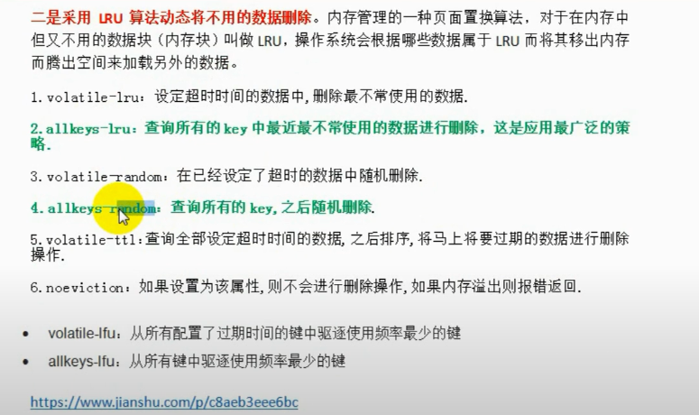

### 简介

redis是nosql的key-value的数据库，是一个简单的、高效的、分布式的、基于内存的缓存工具。

搭设好服务器后，通过网络连接，提供key-value的缓存服务。

在面对大规模和高并发的环境下，关系型数据库显得力不从心，暴露出很多问题。nosql数据库应用而生。	

#### 区别与联系

关系型数据库：表和表之间的关联关系

nosql数据库：数据之间彼此没有关系

选择nosql数据库的原因：

1、数据模型比较简单，没有那么多的字段值

2、对数据库性能要求比较高（存取比较快）

3、不需要高度的数据一致性

4、对于给定key，比较容易映射复杂值的环境

#### 数据库特点

redis以及key-value数据库特点：

1、数据的持久化，将内存中的数据保存在磁盘中，	重启时可以重新加载使用

2、redis支持String、List、HashSet、Set以及Ordered Set数据类型

3、原子性  单个操作是原子性，多个操作也支持事务

4、支持集群，redis支持16个库

5、消息队列

### 配置信息

~~~conf
daemonize yes #设置为守护线程
port  6357  #端口号
bind 127.0.0.1 ::1 #绑定只能某些ip地址可以访问
save [seconds] [changes]
dbfilename dump.rdb #指定数据库的文件名 --数据的存放文件
dir ./  #指定本地数据库存放目录
requirepass foobared #设置连接密码，客户端访问需要通过AUTH(password)授权访问
maxclients #最大允许客户端访问数
maxmemory #最大的默认存储内存
~~~

### 启动

找到redis安装目录，在src目录下启动redis服务

~~~
./redis-server ../redis.conf
~~~

登录redis-cli客户端

~~~
./redis-client -h [host] -p [port] -a [password] # 依次为主机  端口号  密码
~~~

### 内存方案

redis内存占用较大解决方案：

1、为数据设置超时时间

2、配置内存为1/4到1/2之间

3、采用LRU算法进行数据的处理

### 常用命令

~~~
del key	 #删除key值
exists key 	#判断key是否存在
expire key #seconds 对key设置过期时间(单位秒)：
ttl key #检查key剩余时间(-1代表永久有效，-2代表已经失效)
pexpire key milliseconds #对key设置过期时间(单位毫秒)
pttl key 
persist key #将某key设置为永久有效
keys pattern  #keys * 查询所有的key | keys dept?  查询以dept开头后面只有一个字符的key值
randomkey #随机key
rename oldkey newkey 	#更改key的名字
move key db #将某key移入某序号的数据库，redis支持16个数据库
type key #返回某key的数据类型
flushall #清空所有数据库的数据
flushdb #清空当前数据库的数据

~~~

#### expire key

1、用于限时优惠活动

2、数据排行榜

3、手机的验证码

4、限制访客的访问次数（每分钟访问10次）

#### key的命名

单个key存入最大的内存为512m

1、命名不要太长，否则占内存，并且查找效率低

2、命名不要太短，否则可读性太差

3、在一个项目中，key使用统一的命名格式：user:123:password

4、key的命令不区分大小写，但是key的值区分大小写

### 支持类型

String、hash、List、Set、zset

#### String

String类型是二进制安全：

1、编译、解码发生在客户端，执行效率高

2、不要频繁的编解码，不会出现乱码

~~~redis
get key	#查询当前值
getrange key startindex endindex #截取当前key值
set key value #设置key值，key值不存在无法设置成功
setnx key value #设置key值，key值存在时无法设置，当key不存在时，设置当前值  
getset key value #先取出a的值然后再赋值
strlen key #获取当前key的长度	
del key #删除key
incr key #自增key，如果key不存在，则新建key，并初始化key值为0，然后再自增1
decr key #自减key,
incrby key increment #按照指定值增长
decrby key decrement #按照指定值减少
~~~

setnx key value

分布式锁的解决方案之一

incrby key increment

decrby key decrement

##### 应用场景

1、string通常用于保存单个字符或者json格式数据

2、string二进制安全。因此完全可以存入照片

3、计数器（微博数、粉丝数）

​	incr操作具有原子性，无论有多少用户来同时进行读写，都不会出现写入数据的错误。

#### Hash(哈希)

非常相像于一个javabean对象，适合存储javabean对象

~~~
#取值语法
hget key field
hmget key field1 field2 field3
hgetall key

#赋值语法
hset key field value
hmset key field1 value1 field2 value2 field3 value3

#其他
hkeys key #获取当前key的所有字段
hlen key #获取当前key的字段数量

#删除
hdel key field field2 field3 #删除一个或多个字段

hincrby key field increment#使对象中的整形字段增加某个值

hexists key field 判断某个字段是否存在
	
~~~

##### 应用场景

存储java对象

string存储对象可能问题：

1、序列化和反序列化的问题，转换为java对象的问题

2、修改值得问题，并发的问题。

#### List

类似于java中的LinkedList

##### 常用命令

~~~
lpush key a b c d e
rpush key 1 2 3 4 5	
lpushx key a b c d e
rpushx key 1 2 3 4 5	

llen key #获取列表长度
lindex key index #获取列表中的元素
lrange key start end
#start 和 end 表示开始和结束 start的0 1 2.  end 用-1 -2 -3

lpop key #弹出左侧第一个元素
rpop key #弹出右侧第一个元素
lrem count value # 如果count>0,从左边开始移除与value1·
blpop key [key2] timeout	#弹出左侧第一个元素，如果没有则阻塞或者等待时间超时
brpop key [key2] timeout	#弹出右侧第一个元素，如果没有则阻塞或者等待时间超时
ltrim key start end 	#start 和 end 表示开始和结束 start的0 1 2.  end 用-1 -2 -3

lset key index value	#修改某个索引对应元素的值
linsert key before/after word value #在第一个word元素前后插入某个值value
rpoplpush source destination #将source的最右侧元素复制给destination最左侧的元素
~~~

##### 应用场景

1. 数据量超级大的集合删减，使用lrange命令实现分页的功能

   关注列表、粉丝列表、留言评价、热点新闻等

2. 订单系统

#### Set

类似于java中的hashtable，而不是hashset，是不重复的string的集合

##### 常用命令

~~~
sadd key m1 m2 m3 #向当前集合中添加数据
smembers key  #获取当前集合的所有数据
scard key	#获取当前集合的长度
srandmember key [count]	#随机集合中的一个值或多个值

sismember key value	#判断是否存在某个值
srem key value value2 value3 #移除集合中的一个或多个值

spop key [cout]#随机移除一个或者多个集合元素并返回
smove source destination v1 #将source中的v1移到destination中

sdiff key1 key2 #返回key1和key2的差集，以key1为准
sdiffstore destination key1 key2
sinter destination key1 key2 #返回交集
sinterstore destination key1 key2
sunion key1 key2 #返回并集
sunionstore destination key1 key2 #返回并集并存入destination
~~~

##### 应用场景

1、判断用户名是否存在

2、用于随机的抽奖

3、用于有共同爱好的应用

#### ZSET

##### 特点

1、一种有序集合，不允许重复的string元素的集合

2、不同于set，Zset中的每个元素都包含一个double类型的分数，通过分数的大小进行排序

3、每个元素是惟一的，分数可以重复

4、集合是通过哈希表实现的，所以添加、删除、查找的复杂度为O(1)

##### 常用命令

~~~
zadd key score1 value1 score2 value2 #向集合中插入数据，也是修改命令
zcard #获取集合的长度
zrange key start stop #获取集合的数据，默认按照分数
zrevrange key start stop #反转获取集合的数据

zrem key memeber #移除集合中的元素member
zremrangebyrank key start stop #按照排行榜移除元素
zremrangebyscore key min max #按照分数移除元素
~~~

应用场景

1、Twitter的信息，时间作为分数，内容作为value插入

2、排行榜，按照人气自动排序

3、新闻热点，按照点阅人数

### java连接redis

Jedis

RedisTemplate存入数据时，会进行默认的序列化

### 发布订阅

#### 常用命令

~~~
subscribe channel1 [channel2..] #订阅频道
psubscribe channel1 message #向频道发布消息
~~~

#### 应用场景

1、即时聊天、群聊

2、推送消息，微博博主向粉丝推送文章

3、微信公众号模式

4、youtube向订阅者推送消息

### 多数据库

redis下的数据库通过索引找到，而不是通过名称找到，默认连接到0号数据库

#### 常用命令

~~~
select index #选择或者切换数据库
move key index #从当前数据库将key移送动指定的数据库

flushdb #清除当前数据库的所有数据
flushall #清除所有数据库的数据
~~~

### redis事务

~~~
multi #开启事务
exec #执行事务
discard #取消队列中的所有命令，取消事务
watch key #监视某个数据，当在事务中发现监视的数据发生改变时，就会取消事务
unwatch #取消所有监视的数据
~~~

1、输入multi命令之后，就会开启事务，在exec执行之前的所有命令都会进入一个任务队列中去，并被序列化，作为一个整体，中间不会额外插入任何其他命令。

2、输入exec之后，这个任务队列就会去执行

#### 应用场景

适合应用于一系列操作是一个整体不能分割时。

eg:秒杀活动

### 淘汰策略

### 数据持久化

分为rdb和aof两种模式

#### rdb 

快照模式

产生快照条件：

1、服务器正常关闭 shutdown

2、按照配置 

应用条件：内存较大的服务器 

aof

每执行写命令时，都计入文件中，然后保存如磁盘。启动时加载磁盘然后初始化数据

### 数据一致性

redis内存中与MySQL的数据保持一致

#### 解决方案

##### 实时同步

​	对于强一致性的要求，在查询时查询不到时，先从数据库中取出数据，在将数据缓存在redis内存中；更新数据时，先更新数据库，然后设置redis数据过期，

​	查询key值不存在时，在并发量高时，很多用户将会查询不到key对应的数据，将会产生大量用户从数据库获取数据的情况，也就是缓存穿刺，数据库服务崩溃，从而引发雪崩效应。 缓存预热

​	key的过期时间不要集中在一个时间点，要用随机的方式分布起来，这样来解决一个时间点，key集体失效导致的数据库大量访问的问题

 	**删除缓存而不是更新缓存？**

因为缓存有的时候不是简单的查询出来，而是通过复杂计算所得（过程涉及到多张表的数据），同时有可能数据修改比较频繁比如一分钟修改了20次，但是访问量一分钟值访问了一次。如果修改的20次每次均需要缓存的话，就会浪费大量的缓存耗费。

​	**先删除缓存，然后更新数据库**[单线程还行]

这样即使数据库更新失败了，缓存中没有数据，依旧会从数据库中取数据，只不过数据时旧的而已，仍旧保证了数据的一致性

​	**先更新数据库，再删除缓存**

线程并发访问时，保证数据可以一致

##### 异步队列

##### 阿里工具canal

模拟slaver和master的机制

1、master将改变记录存入二进制日志binarylog里面，这几记录叫二进制日志事件

2、slaver将binarylog读入

3、slaver重做binarylog的事件，来改变自己的数据

##### udf触发器

由c/c++语言编写，学习成本相对较高

##### 定时任务

每天定时在某个时间点缓存到redis数据内存中

### 缓存雪崩

某一个时刻，缓存大量失效，从而引发大量的数据查询，引起db服务器崩溃

#### 解决方法

1、加锁排队，限流

​	滑动窗口，计数，验证码

2、缓存预热

### 系统设计

#### 要求

##### 高可用

保证服务器在任何情况下都可以使用，不能因为部分地方出现故障，从而导致整个服务停止

##### 高并发

响应时间

吞吐量  单位时间内处理的请求数量

每秒查询率	和吞吐量差不多

并发用户量 同事承载用户访问的数量

#### 解决方案

分为垂直扩展和水平扩展

##### 垂直扩展

1、提升单片机的硬件性能。cpu处理能力，内存扩大

2、提升框架性能。如增加数据库的查询能力（添加索引），业务逻辑的优化，添加redis服务器，使用缓存数据而不是数据库数据

水平扩展

增加服务器的数量。

### 主从复制

#### 应用场景

一次写入，多次浏览，多读少写

读写分离

配置使用

ofslave

### Redis-cluster

1、无中心结构：彼此互联，内部使用二进制协议优化传输速度和带宽

2、节点失败超过半数时集群才失效  

3、客户端与redis直连，不需要代理

容错性：从错误中恢复的能力（可靠性、可用性、可测性）

**投票**

​	参与者：master

​	规则：当master与半数的master节点失去连接时，认为当前的master挂掉（宕机）	

#### 安装ruby

添加阿里的镜像

~~~
gem sources -a http://mirrors.aliyun.com/rubygems/
~~~

~~~
yum -y install ruby ruby-devel rubygems rpm-build #安装ruby
~~~

~~~
gem install redis
~~~

ruby时创建集群必须的依赖

#### 升级ruby

#### 安装RVM

~~~
gpg --keyserver hkp://keys.gnupg.net --recv-keys 409B6B1796C275462A1703113804BB82D39DC0E3 7D2BAF1CF37B13E2069D6956105BD0E739499BDB
curl -sSL https://get.rvm.io | bash -s stable

#重新加载资源
source /etc/profile.d/rvm.sh
#显示可以使用的版本
rvm list known
~~~

创建集群

~~~
./redis-cli --cluster create  127.0.0.1:7001 127.0.0.1:7002 127.0.0.1:7003 127.0.0.1:7004 127.0.0.1:7005 127.0.0.1:7006 -a bestbnf
#查看节点集群信息
cluster nodes
~~~

