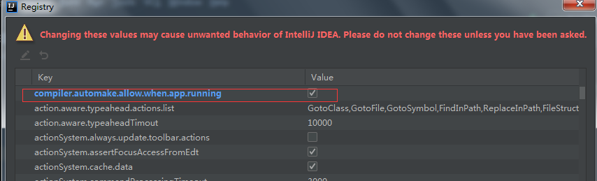

## springboot的使用

### spring优缺点

优点：spring代码属于轻量级的，通过依赖注入、ioc以及aop技术实现了代码级的轻量级开发。

缺点：代码轻量级，但是配置却是重量级的。大量的xml配置、注解配置，以及pom文件中的依赖关系以及版本控制

springboot解决了这些问题

### springboot

约定 》 配置 》 代码

提供了一种快速进行spring开发的方式

必配父项目

```xml
<parent>
    <groupId>org.springframework.boot</groupId>
    <artifactId>spring-boot-starter-parent</artifactId>
    <version>2.3.9.RELEASE</version>
</parent>
```

热部署配置

pom文件中引入依赖

```xml
<!-- 热部署依赖 -->
<dependency>
    <groupId>org.springframework.boot</groupId>
    <artifactId>spring-boot-devtools</artifactId>
</dependency>
```

由于idea自身的原因，需要修改project字段编译，并且alt+shift+ctrl+/ 点击注册registery


然后选择红色框选内容

