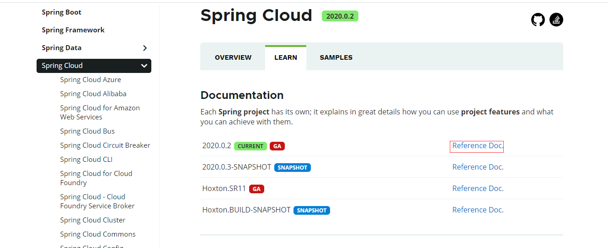
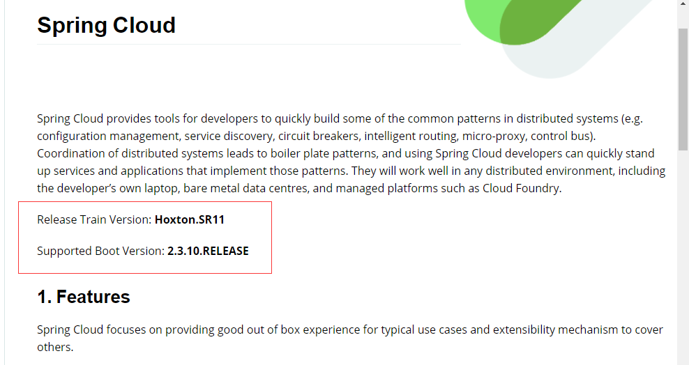
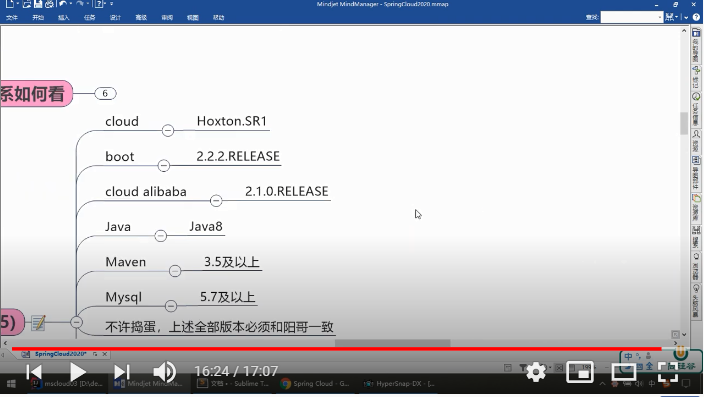

# 前情介绍

## springboot和springcloud选择

### Alpha、Beta、Gamma版本

以下三者，在系统、架包、软件的开发过程中，使用。
Alpha：内测版，BUG多，开发人员开发过程中使用，希腊字母α，第一，指最初版
Beta：早期版本，有缺陷，无大BUG，可能加入新功能，进一步开发完善。
Gamma: 经beta 版，完善修改，成为正式发布的候选版本（Release Candidate）

### RC、GA、R版本

RC：(Release Candidate)：候选版本，几乎就是正式版了，
GA：（Ggeneral Availability）：发行稳定版，官方推荐使用此版本。
R，RELEASE：正式版，等价于GA

### SNAPSHOT版本

- SNAPSHOT：快照版，可以稳定使用，且仍在继续改进版本。

查找对应版本的具体方法



点击红色部分进入



然后就可以清晰的得到对应的版本

一个参考



## 停更说明

### 服务注册	

​		**Ereaka** 停止更新

​		替代框架

​				**Zookeeper**

​				**Consul**

​				**Nacos**

### 服务调用

​		**ribbon** 仍在使用

​		**Feign** 停止更新

​		替代框架

​				**LoadBalancer**

​				**Feign2**

### 服务降级

​		**Hystrix**  停止更新

​		替代框架

​				**resilence4J** 国外使用

​				**sentient** 	国内使用

### 服务网关

​			**Zuul** 停止更新

​			替代框架

​					**gateway**

### 服务配置

​			**Config** 停止更新

​			替代框架

​					**Nacos**

### 服务总线

​			**Bus** 停止更新

​			替代框架

​					**Nacos**

# 开始

## 新建父工程

新建一个最简单的maven工程，搭建工程环境

### 环境搭建

1、编写代码的字符集选择 utf-8 

2、编译时启动注解 enable XXX 启用

3、编译时工程采用的jdk环境 选择jdk8

4、filetype文件类型的过滤（*.idea, *.iml）

### 修改pom

```xml
<?xml version="1.0" encoding="UTF-8"?>
<project xmlns="http://maven.apache.org/POM/4.0.0"
         xmlns:xsi="http://www.w3.org/2001/XMLSchema-instance"
         xsi:schemaLocation="http://maven.apache.org/POM/4.0.0 http://maven.apache.org/xsd/maven-4.0.0.xsd">
    <modelVersion>4.0.0</modelVersion>

    <groupId>com.nx.beitie</groupId>
    <artifactId>springcloud_parent</artifactId>
    <version>1.0-SNAPSHOT</version>
    <packaging>pom</packaging>
    <properties>
        <project.build.encoding>UTF-8</project.build.encoding>
        <maven.compiler.version>1.8</maven.compiler.version>
        <maven.compiler.target>1.8</maven.compiler.target>
        <junit.version>4.12</junit.version>
        <log4j.version>1.2.17</log4j.version>
        <lombok.version>1.16.18</lombok.version>
        <mysql.version> 5.1.47</mysql.version>
        <druid.version>1.1.16</druid.version>
        <spirng.cloud.version>Hoxton.SR1</spirng.cloud.version>
        <spring.boot.version>2.2.2.RELEASE</spring.boot.version>
    </properties>
    <dependencyManagement>
        <dependencies>
            <dependency>
                <groupId>org.springframework.cloud</groupId>
                <artifactId>spring-cloud-dependencies</artifactId>
                <version>${spirng.cloud.version}</version>
                <type>pom</type>
                <scope>import</scope>
            </dependency>
            <dependency>
                <groupId>org.springframework.boot</groupId>
                <artifactId>spring-boot-dependencies</artifactId>
                <version>${spring.boot.version}</version>
                <type>pom</type>
                <scope>import</scope>
            </dependency>
            <dependency>
                <groupId>mysql</groupId>
                <artifactId>mysql-connector-java</artifactId>
                <version>${mysql.version}</version>
            </dependency>
            <dependency>
                <groupId>com.alibaba</groupId>
                <artifactId>druid</artifactId>
                <version>${druid.version}}</version>
            </dependency>
            <dependency>
                <groupId>org.mybatis.spring.boot</groupId>
                <artifactId>mybatis-spring-boot-starter</artifactId>
                <version>1.3.0</version>
            </dependency>
            <dependency>
                <groupId>junit</groupId>
                <artifactId>junit</artifactId>
                <version>${junit.version}</version>
                <scope>test</scope>
            </dependency>
            <dependency>
                <groupId>log4j</groupId>
                <artifactId>log4j</artifactId>
                <version>${log4j.version}</version>
            </dependency>
        </dependencies>
    </dependencyManagement>

</project>
```

#### dependencyManagement

顶层pom文件的配置属性，用于管理子项目的依赖版本。子项目会从下而上一次查找出依赖所定义的版本号。

特点：

1、只声明版本管理，不引入jar包的依赖

2、子项目改变了版本号，以子项目的版本号为准

### mvn intall

打包到本地仓库，让其项目可以引用到父项目