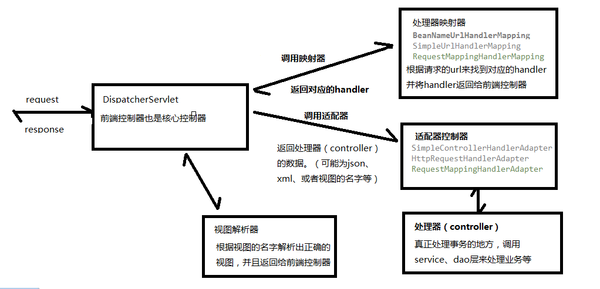

#### 1.springMVC的结构图



​		**DispatcherServlet**: 	**前端控制器**。负责接收用户的请求(request)，调度映射器、适配器、视图解析器等来完成请求的处理

​		**HandlerMapping**:	**处理器映射器**。负责根据用户请求的url来查找对应的handler，将handler交给DispatcherServlet。

​		**HandlerAdapter:** 	**处理器适配器**。负责解析请求的数据，并将解析的数据赋值给调用的handler方法，包括校验参数。由适配器来调用Controller（即handler）。并将返回的视图名返回给DispatcherServlet。

​		**ViewResolver:**	**视图解析器**。负责将物理（字符串视图名）解析为逻辑视图名，并进行渲染，然后返回给DispatherServlet.

​		**DispatcherServlet**: 	**前端控制器**。负责将视图解析器出的视图返回给用户（response）。


#### 2.处理器的详解

##### 	2.1	**HandlerAdapter**

​		2.1.1	**SimpleControllerHandlerAdapter**：支持实现Controller接口的handler类，为此类型的handler提供请求参数的解析，方法参数的验证，方法参数的赋值，以及对返回值的处理。

```java
public class SimpleControllerHandlerAdapter implements HandlerAdapter {

   @Override
   public boolean supports(Object handler) {
      return (handler instanceof Controller);
   }
}
```

```java
public class UserInfoHandler implements Controller {
    @Override
    public ModelAndView handleRequest(HttpServletRequest request, HttpServletResponse response) throws Exception {
        List<User> list=new ArrayList<User>();
        User user=new User();
        user.setUname("张三");
        user.setUage(21);
        user.setUid(1);
         ModelAndView modelAndView=new ModelAndView();
        modelAndView.addObject("userInfoList",list);
        modelAndView.setViewName("userInfo");
        return modelAndView;
}
```

在xml中的配置：

```xml
<!-- 处理映射器 -->
<!-- 1.根据bean的name进行查找Handler 将action的url配置在bean的name中 -->
<bean class="org.springframework.web.servlet.handler.BeanNameUrlHandlerMapping" />

<!-- 处理适配器 -->
<!-- 1.处理器适配器 配置SimpleControllerHandlerAdapter ，要求handler必须实现Controller接口 -->
 <bean class="org.springframework.web.servlet.mvc.SimpleControllerHandlerAdapter" />

<!-- 处理器handler -->
<bean id="controller1" name="/queryUserListInfo" class="com.beitie.handler.UserInfoHandler"></bean>
```

​		这样就可以通过请求http://localhost:8080/queryUserListInfo.action进行访问了。

​		**2.1.2	HttpRequestHandlerAdapter**：支持实现HttpRequestHandler接口的handler类，为此类型的handler提供请求参数的解析，方法参数的验证，方法参数的赋值，以及对返回值的处理。

```java
public class HttpRequestHandlerAdapter implements HandlerAdapter {

   @Override
   public boolean supports(Object handler) {
      return (handler instanceof HttpRequestHandler);
   }

   @Override
   @Nullable
   public ModelAndView handle(HttpServletRequest request, HttpServletResponse response, Object handler)
         throws Exception {

      ((HttpRequestHandler) handler).handleRequest(request, response);
      return null;
   }
}
```

Controller

```java
public class UserInfoHandler2 implements HttpRequestHandler {
    @Override
    public void handleRequest(HttpServletRequest request, HttpServletResponse response) throws ServletException, IOException {
        List<User> list=new ArrayList<>();
        User user=new User();
        user.setUname("张三");
        user.setUage(21);
        user.setUid(1);
        list.add(user);
        request.setAttribute("userInfoList",list);
        request.getRequestDispatcher("/WEB-INF/jsp/userInfo.jsp").forward(request,response);
    }
}
```

```xml
<bean id="controller1"  class="com.beitie.handler.UserInfoHandler"></bean>
<!-- 处理映射器 -->
<!-- 1.根据bean的name进行查找Handler 将action的url配置在bean的name中 -->
<bean class="org.springframework.web.servlet.handler.SimpleUrlHandlerMapping" >
    <property name="mappings">
        <props>
            <prop key="/queryUserListInfo.action">controller1</prop>
            <prop key="/queryUserListInfo2.action">controller2</prop>
        </props>
    </property>
</bean>

<!-- 处理适配器 -->
<!-- 1.处理器适配器 配置SimpleControllerHandlerAdapter ，要求handler必须实现Controller接口 -->
<bean class="org.springframework.web.servlet.mvc.HttpRequestHandlerAdapter" />

<!-- 处理器handler -->
<bean id="controller2" class="com.beitie.handler.UserInfoHandler2"></bean>
```

​		这样就可以通过请求http://localhost:8080/queryUserListInfo.action或者http://localhost:8080/queryUserListInfo2.action分别对handler和handler2进行访问了。